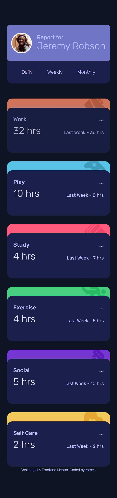

# Frontend Mentor - Time tracking dashboard solution

This is a solution to the [Time tracking dashboard challenge on Frontend Mentor](https://www.frontendmentor.io/challenges/time-tracking-dashboard-UIQ7167Jw). Frontend Mentor challenges help you improve your coding skills by building realistic projects.

## Table of contents

- [Overview](#overview)
  - [The challenge](#the-challenge)
  - [Screenshot](#screenshot)
  - [Links](#links)
- [My process](#my-process)
  - [Built with](#built-with)
  - [What I learned](#what-i-learned)
  - [Continued development](#continued-development)
- [Author](#author)

## Overview

### The challenge

Users should be able to:

- View the optimal layout for the site depending on their device's screen size
- See hover states for all interactive elements on the page
- Switch between viewing Daily, Weekly, and Monthly stats

### Screenshot



### Links

- Solution URL: [Time Tracking Dashboard Repo](https://github.com/mbtenkorang/time-tracking-dashboard-fem)
- Live Site URL: [Time Tracking Dashboard](https://time-tracking-dashboard-fem.onrender.com)

## My process

### Built with

- Semantic HTML5 markup
- Flexbox
- CSS Grid
- Mobile-first workflow
- [Vue](https://vuejs.org/) - Progressive Javascript Framework
- [Vite](https://vitejs.dev/) - For bundling

### What I learned

How to send and emit event to a prarent element in VueJS.

The navigation links in the header component has been assigned a click event handler that runs an emit function with the value of the clicked target.

```vue
<!-- In child component -->
<script setup>
const emit = defineEmits(["getrecordforperiod"]);

const handleSelectedTime = (event) => {
  emit("getrecordforperiod", event.target.innerHTML.toLowerCase());
};
</script>
```

In the parent element, the emitted event is handled by another function that receives the value from the click event and assign it as the value of a reactive object.

```vue
<script setup>
import { ref } from "vue";
import ChildComponent from "./components/ChildCompoent.vue";

const selectedTimeFrame = ref("");

const selectedValue = (s) => {
  selectedTimeFrame.value = s;
};
</script>

<template>
  <ChildComponent @getrecordforperiod="selectedValue" />
</template>
```

### Continued development

- Get the url to reflect the current path.
- Extract the ternary operators in InformationCard component that determine the value for "hr" or "hrs" into a single function.

## Author

- Website - [Moses GitHub](https://github.com/mbtenkorang)
- Frontend Mentor - [@mbbtenkokrang](https://www.frontendmentor.io/profile/mbtenkorang)
